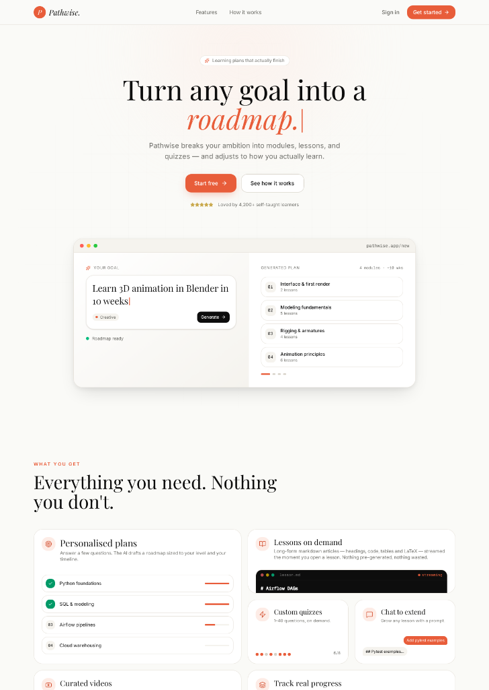
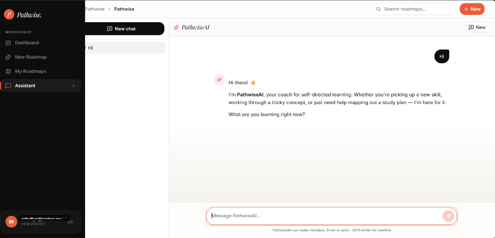

# PathWise AI

PathWise AI is an intelligent learning roadmap generator that helps users achieve their educational goals. By simply entering a learning objective, the AI automatically generates a comprehensive, structured roadmap complete with modules, interactive lessons, and quizzes to track your progress.

This repository contains the full-stack application, divided into independent `frontend` and `backend` services.

---

## 📸 Screenshots

| Landing Page | Chat App |
| ------------ | -------- |
|  |  |

---

## ✨ Features

- **AI-Powered Roadmaps:** Instantly generate personalized learning paths based on your specific goals.
- **Structured Learning Modules:** Roadmaps are broken down into digestible modules and individual lessons.
- **Interactive Quizzes:** Test your knowledge with dynamically generated quizzes at the end of each module.
- **Progress Tracking:** Keep track of your completed lessons and quiz scores.
- **Full-Screen Reading Mode:** Immerse yourself in the generated lesson content with a distraction-free full-screen UI.
- **Beautiful & Modern UI:** Built with Shadcn UI and Tailwind CSS for a premium, accessible, and responsive design.
- **Independent Microservices:** Fully decoupled frontend and backend for easy deployment and scalability.

---

## 🛠 Tech Stack

### Frontend
- **Framework:** [React 19](https://react.dev/)
- **Build Tool:** [Vite](https://vitejs.dev/) + Nitro
- **Routing:** [TanStack Router](https://tanstack.com/router/latest)
- **Styling:** [Tailwind CSS v4](https://tailwindcss.com/) & [Shadcn UI](https://ui.shadcn.com/)
- **Data Fetching:** [TanStack Query](https://tanstack.com/query/latest)

### Backend
- **Runtime:** [Node.js](https://nodejs.org/)
- **Framework:** [Express.js](https://expressjs.com/)
- **Database:** [MongoDB](https://www.mongodb.com/) via [Mongoose](https://mongoosejs.com/)
- **Authentication:** JWT (JSON Web Tokens)
- **AI Integration:** OpenAI-compatible API endpoints (e.g. Claude, GPT-4)

---

## 📦 Project Structure

```text
/
├── backend/                # Node/Express API Server
│   ├── src/                # Backend source code (routes, models, controllers)
│   ├── .env                # Backend environment variables
│   └── package.json        
│
├── frontend/               # React Frontend Application
│   ├── public/             # Static assets
│   ├── src/                # Frontend source code (components, routes, lib)
│   ├── .env                # Frontend environment variables
│   └── package.json
│
└── README.md               # This file
```

---

## 🚀 Installation & Setup

### Prerequisites

- [Node.js](https://nodejs.org/) (v18 or higher recommended)
- A [MongoDB](https://www.mongodb.com/) instance (local or Atlas)
- An AI API Key (e.g. OpenAI, Anthropic, or Deepshi)

### 1. Clone the repository

```bash
git clone https://github.com/himanchalkaushale/PathWise-AI.git
cd PathWise-AI
```

### 2. Set up the Backend

Open a terminal and navigate to the backend directory:

```bash
cd backend
npm install
```

Create a `.env` file in the `backend` directory with the following variables:

```env
PORT=4000
MONGODB_URI=your_mongodb_connection_string
JWT_SECRET=your_super_secret_jwt_key
AI_BASE_URL=your_ai_base_url
AI_API_KEY=your_ai_api_key
AI_MODEL=your_ai_model
```

Start the backend server:

```bash
npm run dev
```

### 3. Set up the Frontend

Open a **new** terminal and navigate to the frontend directory:

```bash
cd frontend
npm install
```

Create a `.env` file in the `frontend` directory with the following variables:

```env
# The port the frontend dev server will run on
PORT=5173

# The URL pointing to your running backend API
VITE_API_URL=http://localhost:4000
```

Start the frontend development server:

```bash
npm run dev
```

### 4. Open the App

The application will now be running! 
Open [http://localhost:5173](http://localhost:5173) in your browser to start exploring.
